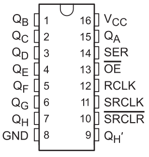
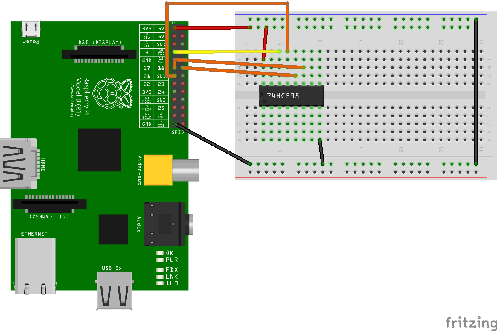

74HC595
=======

Der 74HC595 ist ein Schieberegister, über das mehrere Werte
gleichzeitig ausgegeben werden können, nachdem sie in das Register
geschoben wurden.

Die Werte werden über den Pin `SER` nacheinander in den IC geschoben
und stehen anschließend an der Ausgängen `QA-QH` zur Verfügung. Der
Prozess des Schiebens wird über zwei Clockpins `RCLK`und `SRCLK`
kontrolloiert. Über den Pin `OE` (*output enabled*) wird bestimmt, ob
der Inhalt des Register an den Ausgängen anliegen soll oder nicht.

Schaltung
---------

