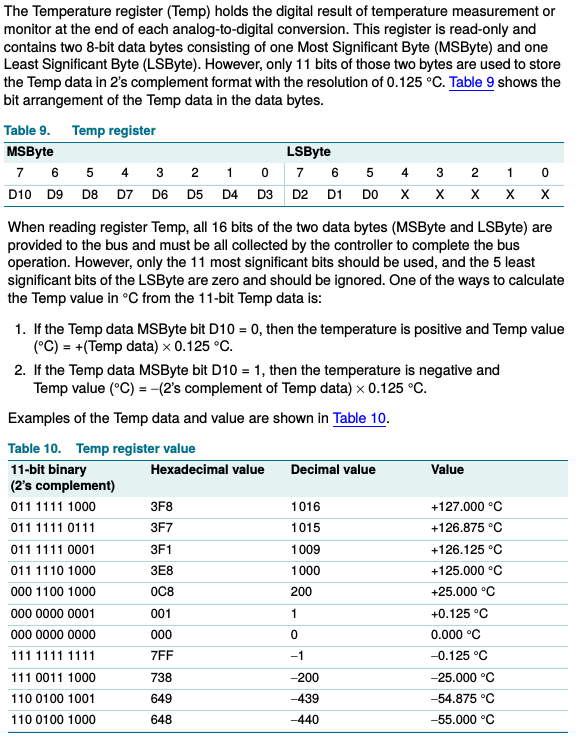

# lm75 Temperatursensor

Der LM75 ist ein Temperatursensor, der sich auch über I²C auslesen
lässt. Hierfür wird der Raspberry Pi mit Pin 5 und 3 mit SCL bzw. SDA
verbunden. Der I²C-Overlay kann mit raspi-config aktiviert werden.

Zuerst wird die Adresse mit `i2cdetect` ermittelt.

    pi@meinpi ~/lm75 $ i2cdetect -y 1
         0  1  2  3  4  5  6  7  8  9  a  b  c  d  e  f
    00:          -- -- -- -- -- -- -- -- -- -- -- -- -- 
    10: -- -- -- -- -- -- -- -- -- -- -- -- -- -- -- -- 
    20: -- -- -- -- -- -- -- -- -- -- -- -- -- -- -- -- 
    30: -- -- -- -- -- -- -- -- -- -- -- -- -- -- -- -- 
    40: -- -- -- -- -- -- -- -- 48 -- -- -- -- -- -- -- 
    50: -- -- -- -- -- -- -- -- -- -- -- -- -- -- -- -- 
    60: -- -- -- -- -- -- -- -- -- -- -- -- -- -- -- -- 
    70: -- -- -- -- -- -- -- --         

Der Sensor meldet sich unter der Adresse `0x48`. Ein einzelner Wert
kann mit i2cget aus dem Register `0x00` (dort liegen die aktuellen
Temperaturen) ausgelesen werden. Die Option `w` liest ein Wort (2
Bytes) aus.

    pi@meinpi ~/lm75 $ i2cget -y 1 0x48 0x00 w
    0x8018

Dieser Wert muss nun in eine Temperatur umgewandelt werden. Hierzu
werden die ersten beiden Bytes getauscht, die letzten 5 Bits
herausgeschoben und das Ergebnis mit 0.125 mal genommen. Wir testen
dies mal für den obigen Wert.

    >>> 0x8018         # Die ersten Bytes tauschen
    32792
    >>> 0x1880
    6272
    >>> 0x1880 >> 5    # 5 Bits nach rechts raus schieben
    196
    >>> 196 * 0.125    # und mit 0.125 multiplizieren.
    24.5
    >>> (0x1880 >> 5) * 0.125 # Alles in einem Schritt
    24.5
    

Es ergeben sich 24,5°C. Im Datenblatt wird der Prozess wie folgt
beschrieben.

Das Programm `temperature.py` in diesem Repo enthält ein
unvollständiges Demoprogramm. Liest dir die Dokumentation durch und
vervollständige es.

