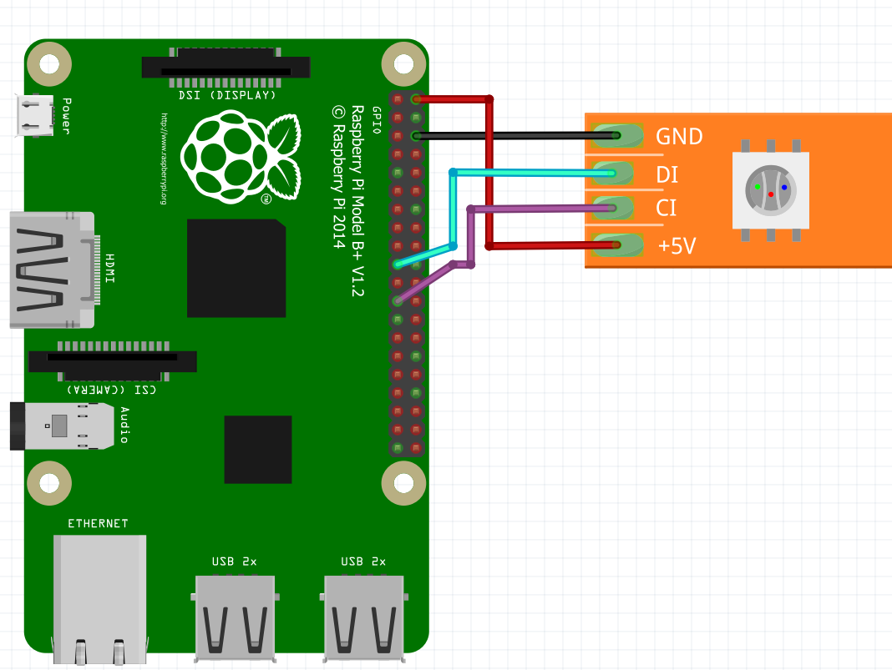
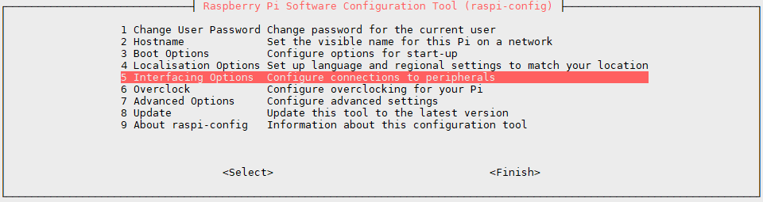
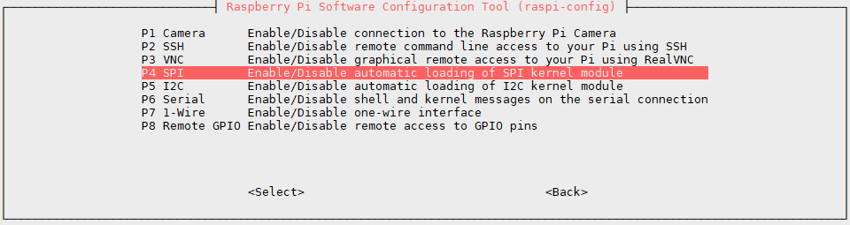
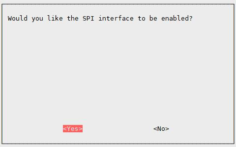
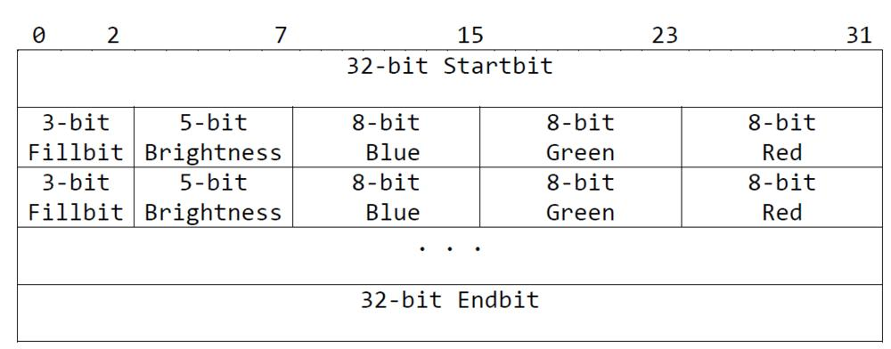

# APA102

Der APA102 ist ein Controller, mit dem RGB-LED auf einem Leuchtstreifen gezielt angesteuert werden können. Er ist ausführlich im [Datenblatt](doc/APA102.pdf) beschrieben. Im Gegensatz zu den [WS281x](../ws281x) wird der APA102 Chipsatz über den SPI Bus angesteuert.

## Schaltung

Für eine geringe Anzahl an LEDs liefert der RPi genügend Strom.
Dabei sieht die Schaltung dann wie folgt aus:

Ab ca. 8-10 LEDs wird ein externens Netzteil mit 5V benötigt.

## Zugriff auf SPI aktivieren

Damit der SPI Bus auf dem Raspiberry Pi verwendet werden kann, muss dieser vorher aktiviert werden.
Über das Konfigurationsprogramm `raspi-config` kann dies ganz leicht erledigt werden.

    $ sudo raspi-config

Zu aller erst in die Interface Optionen:  

Danach das SPI Interface auswählen:  

Und im letzten Schritt SPI aktivieren:  

## Paket Aufbau

Über den SPI Bus wird ein Datenpaket gesendet für alle LEDs.
Das Paket fängt an mit 4 Start Bytes, die 0 sein müssen. Darauf folgt für jede LED die Helligkeit, Roter Farbanteil, Grüner Farbanteil und Blauer Farbanteil.
Zum Schluss folgen 4 End Bytes.  

## Bibliothek

Um die LEDs Anzustuern wird der SPI Bus benötigt. Für die Ansteuerung dessen wird die Bibliothek [spidev](https://pypi.python.org/pypi/spidev) benötigt.

    $ pip3 install spidev

## Quelltext

Mit dem Programm in [apa102.py](apa102.py) leuten alle LEDs gleichtzeitig in voller Helligkeit in einem Cyanblau auf.
