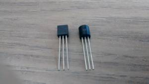

DS18B20
=======



Der DS18B20 ist ein günstiger Temperatursensor (~1€), der seine Daten
über das 1-Wire-Protokoll ausgibt.

Weitere Details sind in dem [Datenblatt](doc/DS18B20.pdf) und auf der
Seite [pinout.xyz](https://pinout.xyz/pinout/1_wire) beschrieben.


Schaltung
---------

Die drei Pins an dem Sensor müssen mit einer Spannungsversorgung und
Masse beschaltet werden. Der dritte Pin wird für die Datenübertragung
benötigt. Für den 1-WIRE Bus ist auf dem Pi hierfür der Pin BCM 4
vorgesehen. Dies kann jedoch auch in der Datei `/boot/config.txt`
geändert werden.

_Achtung!_ Im Datenblatt ist das Pinout von unten ("Bottom View")
dargestellt. Ein Verwechslung der Pins VDD und GND können das Bauteil
stark erhitzen oder zerstören.


Bei der Beschaltung wird ein Pull-Up-Widerstand zwischen die
Datenleitung und die Stromversorgung platziert.

Werte auslesen
--------------

Das Bauteil ist anschließend im Dateisystem vefügbar. Das Vezeichnis
`/sys/devices/w1_bus_master` enthält in Dateien verschiedene
Informationen über den Bus und die daran angeschlossenen Slaves.

```
w1_master_max_slave_count
                   - (rw) maximum number of slaves to search for at a time
w1_master_name     - (ro) the name of the device (w1_bus_masterX)
w1_master_pullup   - (rw) 5V strong pullup 0 enabled, 1 disabled
w1_master_slave_count
                   - (ro) the number of slaves found
w1_master_slaves   - (ro) the names of the slaves, one per line
```

[Quelle: kernel.org](https://www.kernel.org/doc/Documentation/w1/w1.generic)

Eine typische Bezeichnung eines Sensors ist `28-0000064d724b`: 28
beschreibt die Gerätefamilie, der Rest die Seriennummer. Für jeden
Slave wird ein Verzeichnis angelegt, in dem die Daten in der Datei
`w1_slave`liegen.

    pi@meinpi:~ $ cat /sys/devices/w1_bus_master1/28-0000064d724b/w1_slave 
	96 01 4b 46 7f ff 0a 10 0a : crc=0a YES
	96 01 4b 46 7f ff 0a 10 0a t=25375

Die erste Zeile zeigt mit `crc=0a` eine Checksumme an, die bei der
Übertragung generiert wurde. Das `YES` bestätigt dies Checksumme und
damit eine korrekte Übertragung der Daten. 

In der zweiten Zeile steht Sensorwert mit `t=25375` - ein
Temperaturwert von 23,375 °C.

Quelltext
---------

Die Datei [ds18b20.py](ds18b20.py) enthält ein Programm, welches über
das Dateisystem auf den Sensorwert zugreift.

Die Bibliothek
[w1thermsensor](https://github.com/timofurrer/w1thermsensor) geht auf
die gleiche Weise vor, stellt jedoch noch einige weitere
Funktionalitäten für ähnliche Sensoren bereit.
