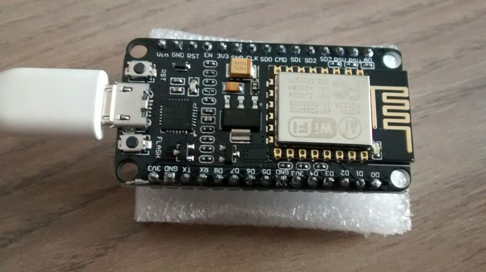
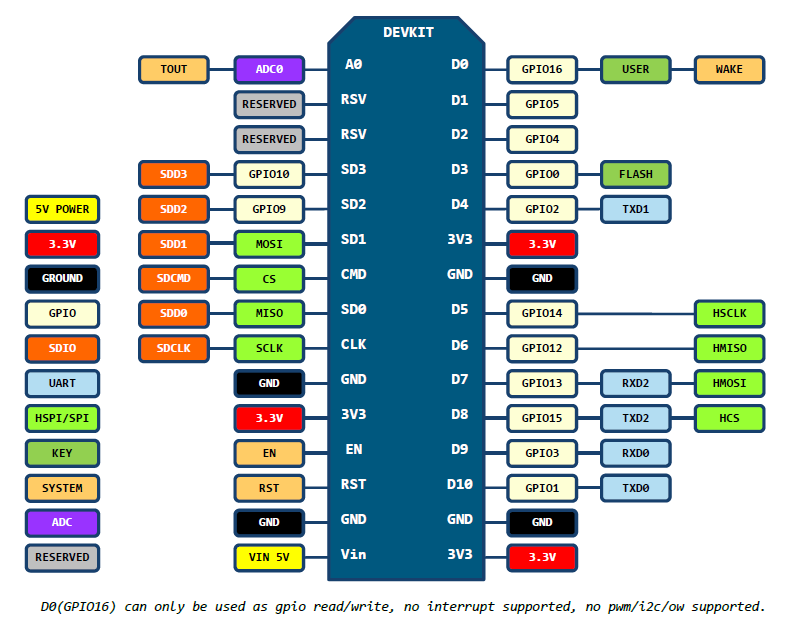

# ESP8266

Der [ESP8266](http://www.mikrocontroller.net/articles/ESP8266) ist ein
günstiger Microcontroller für ca. 3 € mit eingebauten
WLAN-Fähigkeiten. Er wird in Modulen wie ESP-01, ESP-12 oder ESP-12E
verbaut, die sich z.B. in der Anzahl der Pins unterscheiden. Das
ESP-12E-Modul ist recht beliebt, da es sehr viele Pins beistzt und
wird z.B. auf einem Development-Board wie dem nodemcu-devkit (oben
abgebildet) verbaut.

[Micropython](https://micropython.org) ist eine Variante von Python,
die auf verschiedene Mikrocontroller zugeschnitten ist - so auch für
den ESP8266.

Die
[Anleitung von Micopython für den ESP8266](http://docs.micropython.org/en/latest/esp8266/index.html)
erklärt viele wesentliche Funktionen. Weitere technische Details 
befinden sich in den folgenden Dokumenten:

- [quick start guide](doc/esp8266_quick_start_guide_en.pdf)
- [datasheet](doc/0a-esp8266ex_datasheet_en.pdf)
- [system description](doc/0b-esp8266_system_description_en.pdf)
- [AT instruction set](doc/4a-esp8266_at_instruction_set_en.pdf), [AT command examples](doc/4b-esp8266_at_command_examples_en.pdf)
- [technical reference](doc/esp8266-technical_reference_en.pdf)

## nodemcu devkit

Häufig wird der ESP8266 auf einem Entwicklerboard verbaut, um ihn
leichter ansteuern zu können. Eine USB-Schnittstelle stellt zum einen
eine Stromversorgung und zum anderen eine einfache
Kommunikationsmöglichkeit bereit. Die Pins sind auf eine Steckerleiste
herausgeführt und beschriftet. Eine prominenter Vertreter ist das
"nodemcu devkit", welcher auf dem obigen Bild zu sehen ist. Details
über das Enticklungsboard
sind [online](https://github.com/nodemcu/nodemcu-devkit-v1.0) oder
über das [Datenblatt](doc/NODEMCU_DEVKIT_V1.0.PDF) verfügbar.

## Installation der Firmware

Zuerst muss die Firmware für Micropython installiert werden. Diese lässt
sich von der Webseite
[herunterladen](https://micropython.org/download/#esp8266)
oder
[selbst kompilieren](https://github.com/micropython/micropython/tree/master/esp8266).

Für die Installation der Firmware gibt es das Tool `esptool.py`, das
sich ebenso einfach installieren lässt.

    $ sudo pip install esptool

Anschließend kann die vorhandene Firmware auf den ESP8266 zunächst
gelöscht und mit dem zweiten Befehl die neue Firmware übertragen werden.

    $ esptool.py --port /dev/ttyUSB0 erase_flash
    $ esptool.py --port /dev/ttyUSB0 --baud 115200 write_flash --flash_size=detect 0 esp8266-DATUM-v1.VERSION.bin

Wenn es bei Übetragungsgeschwindigkeiten über 115200 Baud zu Problemen kommt,
muss die Geschwindigkeit reduziert werden. 

Die Befehle sind der [Anleitung von
mircopython](http://docs.micropython.org/en/latest/esp8266/esp8266/tutorial/intro.html#deploying-the-firmware)
entnommen.

## Zugriff über die serielle Schnittstelle

Nun kann mit einem Terminalprogramm auf den Microcontroller
zugegriffen werden. Das geht mit `putty, minicom, screen` oder auch
`miniterm.py`, wenn das Board über einen USB-Anschluss
verfügt. Ansonsten fungieren die Pins GPIO1=TX und GPIO3=RX als
serielle Schnittstelle. Die Baudrate beträgt 115200.

    $ screen /dev/ttyUSB0 115200

oder

    $ miniterm.py /dev/ttyUSB0 115200

Für `/dev/ttyUSB0` muss die serielle Schnittstelle angegeben werden,
mit welcher sich der Chip am USB-Port anmeldet. Unter Windows findet man
die Information im Geräte-Manager: `COM` gefolgt von einer Zahl.

Wenn `miniterm.py` noch nicht installiert ist, kann es mit `pip
install pyserial` installiert werden.

Im Anschluss erhält man eine Python-Konsole, die man für eigene Projekte
verwenden kann. Beim Start steht der ESP als Access Point zur Verfügung,
auf den sich Clients mit dem Standardpasswort `micropythoN` verbinden
können.

## Pin-Belegung (nodemcu devkit)

Das [nodemcu-devkit](https://github.com/nodemcu/nodemcu-devkit-v1.0)
ist eines der populärsten Boards, das den ESP8266 verbaut. Hierfür
existiert eine gute Dokumentation der Pinbelegung. Die Nummerierung
bezieht sich jeweils immer auf die Pinnummer am Chip und kann bei
unterschiedlichen Ausführungen von der Nummerierung auf dem jeweiligen
Board abweichen.

## Dateitransfer

Mit dem mächtigen Tool [ampy](https://github.com/adafruit/ampy) lassen
sich leicht Dateien auf den Chip kopieren, von ihm lesen oder auf ihm
ausführen. Es wird mit `pip3 install adafruit-ampy` installiert. Dazu
muss ggf. eine bestehende Verbindung über die serielle Schnittstelle
zuvor beendet werden.

Dateien lassen sich mit `ls` anzeigen. Der Parameter `-p` gibt die
serielle Schnittstelle an, über die die Verbindung besteht.

    $ ampy -p /dev/ttyUSB0 ls

Dateien können mit `get` lokal ausgegeben werden.

    $ ampy -p /dev/ttyUSB0 get main.py

Sie können auch abgespeichert werden.

    $ ampy -p /dev/ttyUSB0 get main.py main.py

Ebenso einfach können Dateien auf den Chip kopiert werden.

    $ ampy -p /dev/ttyUSB0 put main.py

Eine Datei kann auch direkt ausgeführt werden.

    $ ampy -p /dev/ttyUSB0 run mein_script.py

Neben ampy gibt es weitere Tools für den Dateitransfer.
[mpfshell](https://github.com/wendlers/mpfshell) ist ein
shell-basierter Datei-Explorer, um den ESP zu erkunden.
[rshell](https://github.com/dhylands/rshell) ist eine remote
shell für den ESP8266. 
[webrepl](https://github.com/micropython/webrepl) ist 
eine weitere Möglichkeit.

## Ansteuerung über I²C

Der ESP kann über den I²C-Bus auch mit Sensoren oder anderen Modulen
kommunizieren. Zwei der GPIO-Pins werden dafür benötigt: einer als
Clock- (scl) und einer als Daten-Pin (sda).
Die Datei [esp8266_i2c_scan.py](esp8266_i2c_scan.py) zeigt beispielhaft,
wie man auf dem I²C-Bus nach Geräten scannen kann.

## Links

- Vortrag der Froscon 2016: [Python für das Internet der Dinge -
Einführung in MicroPython für ESP8266 und Cortex-M4
Mikroprozessorboards](https://media.ccc.de/v/froscon2016-1791-python_fur_das_internet_der_dinge)
- Unter Windows werden eventuell Treiber für den USB-UART-Konverter benötigt.
  Ein populärer Treiber ist unter 
  [MSXFAQ](http://www.msxfaq.de/sonst/bastelbude/nodemcu.htm) verlinkt.
- [Forum für den 
  Informationsaustausch](http://forum.micropython.org/viewforum.php?f=16) 
  mit Gleichgesinnten.
- [Tutorialreihe mit Videos von Tony DiCola](https://learn.adafruit.com/category/micropython) 
  von Adafruit, die den ESP8266 und die Ansteuerung über MicroPython 
  ausführlich darstellt.
- Ein
[Artikel bei Henry's Bench](http://henrysbench.capnfatz.com/henrys-bench/arduino-projects-tips-and-more/powering-the-esp-12e-nodemcu-development-board/) 
  beschreibt verschiedene Möglichkeiten, um das nodemcu-devkit mit Strom zu
  versorgen.
- Neben Micropython gibt es für das nodemcu-devkit auch eine Firmware,
  die es ermöglichkeit, die Programmiersprache lua zu
  verwenden:
  [NodeMCU Documentation](https://nodemcu.readthedocs.io/). Uwe Berger
  stellte auf der FrOSCon 2017 in dem Vortrag
  [Wi-Fi mit Lua](https://media.ccc.de/v/froscon2017-1953-wi-fi_mit_lua)
  den Chip vor.

