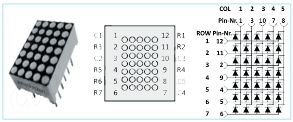
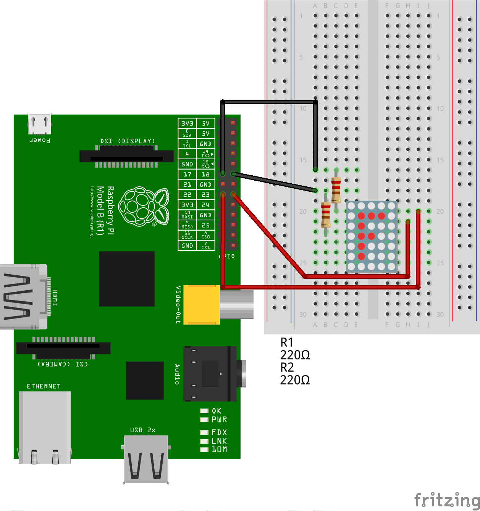

LED-Matrix (5x7)
==============

In der Matrix sind die LEDs in Zeilen und Spalten miteinander
verbunden. Jede LED lässt sich aus einer Kombination von Spalte und
Zeile einzeln ansteuern. Insgesamt werden 5+7=12 GPIO für die
Ansteuerung benötigt.

Die LEDs werden mit einem Vorwiderstand von 220 Ohm betrieben. 

Anschluss
---------

Das Bild zeigt eine unvollständige Anschlussmöglichkeit, mit der die
vier LEDs im linken oberen Bereich angesteuert werden können.

Ansteuerung
-----------

Ein Beispielprogramm zur Ansteuerung der Matrix befindet sich in der
Datei [ledmatrix.py](ledmatrix.py). Ein
[Video](https://youtu.be/pf3Cuj75bP4) zeigt die Matrix im Betrieb.

Datenblatt
----------
Die LED-Matrix ist vergleichbar mit der TC07-11 von Kingbright. 
- [Datenblatt](docs/TA07-11_TC07-11_datasheet.pdf

