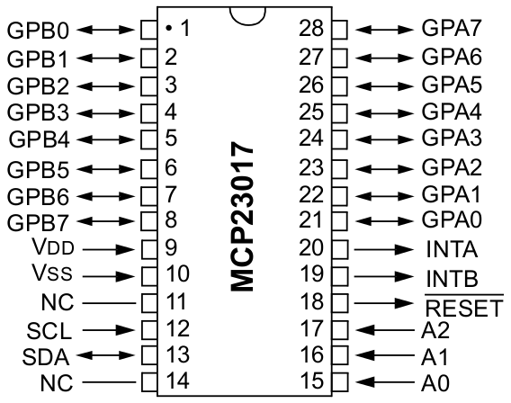
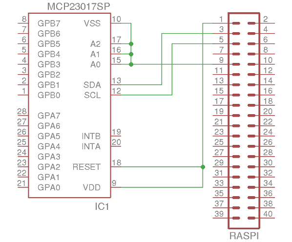

# MCP23017 I/O Expander

## Beschreibung

Der MCP23017 ist ein I/O Expander, der sich über die I²C-Schnittstelle ansteuern lässt. Er verfügt über insgesamt 16 I/O Ports, die sich frei programmieren lassen. Dabei werden jeweils 8 Ports über ein 8-Bit-Register konfiguriert bzw. angesteuert.

## Beschaltung

- VDD: Spannungsversorgung (+) (3,3 V)
- VSS: Spannungsversorgung (-) (Masse)
- SDA: Serial Data (I²C)
- SCL: Serial Clock (I²C)
- A0, A1, A2: Beeinflusst die Slaveadresse des I/O Expanders.
- RESET: Setzt den I/O Expander bei einem Low-Signal (Massepotential) zurück.*
- INTA, INTB: Interrupt-Ausgänge
- GPA0-GPA7, GPB0-GPB7: I/O-Pins

Auf Pulldown-Widerstände an den Busleitungen kann (und sollte) verzichtet werden, da diese bereits am Raspberry Pi vorhanden sind.

* Der Reset-Pin erwartet ein definiertes, externes High- oder Low-Signal. Der Pfeil im Pinout aus dem Datenblatt zeigt in die falsche Richtung.

## Adressierung

Die ersten 4 Bit der Slaveadresse sind beim MCP23017 unveränderbar `0b0100`. Über die Pins A0, A1 und A3 können die letzten (niederwertigen) 3 Bit eingestellt werden. Mit der Betriesspannung (VCC bzw. 3,3 V) an einem Pin wird eine `1` an der entsprechenden Stelle gesetzt. Um eine `0` zu setzen, wird der entsprechende Pin auf Masse (GND) gelegt.

Je nach Beschaltung ergibt sich eine Slave-ADresse zwischen `0x20` und `0x27`. Im Beispiel sind die Adress-Pins auf Masse gelegt, somit hat das Bauteil die Adresse `0x20`.

## Register

folgt

## Datenblatt

- [Datenblatt](docs/mcp23017_mcp23S17_datasheet.pdf)
