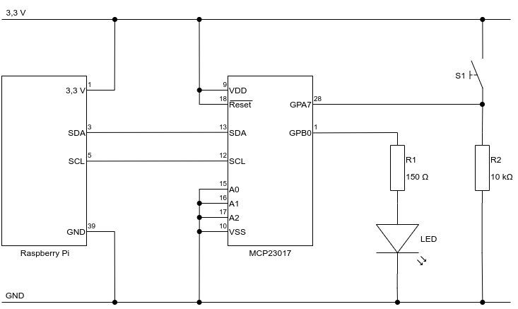

# MCP23017 / sample

In dem Beispiel wird eine LED an GPB0 (Pin1) und ein Taster mit Pull-down-Widerstand an GPA7 (Pin28) angeschlossen. Der Taster wird durch polling abgefragt und bei betätigtem Taster wird "whoop" ausgegeben. Die LED blinkt, wie es sich für ein ordentliches LED-Beispiel gehört. 

Da beim schalten der Output-Pins immer das komplette Register (8 Bit) beschrieben werden muss, kann es vorkommen, dass mehr Output-Pins geschaltet werden, als gewünscht. Daher ist es sinnvoll das Register vor dem Schalten auszulesen und durch entsprechende Maskierung  dafür zu sorgen, dass alle Bits unverändert bleiben, außer das, welches gesetzt oder rückgesetzt werden soll.

Beim Einschalten eines bestimmten Pins wird das entsprechende Bit mit `1` verodert, wobei das Ergebnis immer `1` ist. Alle anderen Bits werden mit `0` verordert, so dass der Wert unverändert bleibt.

Beim Ausschalten eines bestimmten Pins wird das entsprechende Bit mit `0` verundet, wobei das Ergebnis immer `0` ist. Alle anderen Bits werden mit `1` verundet, so dass der Wert unverändert bleibt.

## Schaltung

## Datenblatt

- [Beispielprogramm](mcp23017sample.py)
