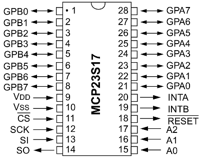
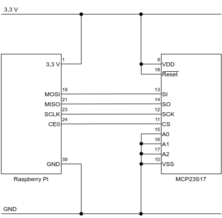

# MCP23S17 I/O Expander

## Beschreibung

Der MCP23S17 ist ein I/O Expander, der sich über die SPI-Schnittstelle ansteuern lässt. Er verfügt über insgesamt 16 I/O Ports, die sich frei programmieren lassen. Dabei werden jeweils 8 Ports über ein 8-Bit-Register konfiguriert bzw. angesteuert.

Der MCP23S17 ist die SPI-Variante des MCP23017, der über den I²C-Bus angesteuert wird.

## Beschaltung

- VDD: Spannungsversorgung (+) (3,3 V)
- VSS: Spannungsversorgung (-) (Masse)
- CS: Chip Select (SPI - CE0)
- SCK: Seriel Clock (SPI)
- SI: Serial Data In (SPI - MOSI)
- SO: Serial Data Out (SPI - MISO)
- A0, A1, A2: Beeinflusst die Adresse des I/O Expanders.
- RESET: Setzt den I/O Expander bei einem Low-Signal (Massepotential) zurück.¹
- INTA, INTB: Interrupt-Ausgänge
- GPA0-GPA7, GPB0-GPB7: I/O-Pins

¹ Am Reset-Pin wird ein definiertes, externes High- oder Low-Signal erwartet. Der Pfeil im Pinout aus dem Datenblatt zeigt in die falsche Richtung.

In der Grundschaltung wird am Raspberry Pi der SPI Bus 0. Chip Select (CS) wird dabei mit CE0 (Pin 24) am Raspberry Pi verbunden. SCK wird an Pin 23, SI an Pin 19 (MOSI) und SO an Pin 21 (MISO) des Raspberry Pi angeschlossen.

## Adressierung

Die ersten 4 Bit der Adresse sind beim MCP23S17 unveränderbar `0b0100`. Über die Pins A0, A1 und A3 können die letzten (niederwertigen) 3 Bit eingestellt werden. Mit der Betriesspannung (VCC bzw. 3,3 V) an einem Pin wird eine `1` an der entsprechenden Stelle gesetzt. Um eine `0` zu setzen, wird der entsprechende Pin auf Masse (GND) gelegt.

Normalerweise gibt es beim SPI-Bus keine Slaveadressen, wie beim I²C-Bus. Die Busteilnehmer (Slaves) werden jeweils über eine "chip select"-Leitung vom Master "angesprochen". Um beim MCP23S17 die Register zu beschreiben bzw. auszulesen, wird die Adresse allerdings in einem "Opcode" (operation code) verwendet. Dieser Opcode ist ein Byte lang. Die ersten 7 Bit entsprechen der Adresse und das letzte (niederweitigste) Bit wird zum Lesen auf `1` gesetzt bzw. zum schreiben auf `0` gesetzt. Im Beispiel wird zum Schreiben der Opcode `0b01000000` verwendet. Lesen kann man den Inhalt eines Register man mit dem Opcode `0b01000001`.

## Register

Genau wie bei den GPIO-Pins des Raspberry Pi, müssen die Pins zunächst als Input- oder Output-Pin konfiguriert werden. Dazu dient das "I/O direction register" des entsprechenden Ports. Standardmäßig sind die Pins beider Ports als Input konfiguriert. In den Registern mit den Adressen `0x00` und `0x01` stehen die Werte `0xff = 0b11111111`. Jedes Bit der Register steht dabei für den entsprechenden Pin des jeweiligen Ports. Das niederwertigste Bit des Registers `0x00` konfiguriert beispielsweise den Pin GPA0 (Pin 21 am IC). Wird ein Bit auf `0` gesetzt, so ist der entsprechende Pin ein Output-Pin.

Über "General purpose I/O port register" (Adresse `0x12` für Port A und `0x13` für Port B) lässt sich der Signalwert (0 = low, 1 = high) der entsprechenden Pins lesen. Die Output-Pins können über das "Output latch register" (Adresse `0x14` für Port A und `0x15` für Port B) ein- bzw. ausgeschaltet werden. Durch das Schreiben in das GPIO-Register wird ebenfalls das Output-Latch-Register verändert.

Mit dem "input polarity port register" können die Signale an den Input-Pins invertiert werden. Dies kann beispielsweise nützlich sein, wenn man Pull-up-Widerstände oder das GPPU-Register verwendet.

Das IC verfügt für jeden Port über 8 weitere Register. Unter anderem kann man über diese Register das Verhalten der Interrupt-Pins (Pin 19 und 20) beeinflussen. Für erste Experimente können diese Register unverändert bleiben.

### IODIRA (IODIRB) - I/O direction register Port A (Port B) - 0x00 (0x01)
* 1: Konfiguration des Pins als input (default)
* 0: Konfiguration des Pins als output

### IPOLA (IPOLB) - Input polarity port register Port A (Port B) - 0x02 (0x03)
* 1: invertiert die Eingangssignale
* 0: keine Invertierung (default)

### GPIOA (GPIOB) - General purpose I/O port register Port A (Port B) - 0x12 (0x13)
* 1: High-Signal am Pin
* 0: Low-Signal am Pin (default)

### OLATA (OLATB) - Output latch register Port A (Port B) - 0x14 (0x15)
* 1: High-Signal
* 0: Low-Signal (default)

### Weitere Register
* GPINTEN - Interrupt-on-change Pins (0x04/0x05)
* DEFVAL - Default value register (0x06/0x07)
* INTCON - Interrupt-on-change control register (0x08/0x09)
* IOCON - Configuration register (0x0A/0x0B)
* GPPU - GPIO Pull-up resistor register (0x0C/0x0D)
* INTF - Interrupt flag register (0x0E/0x0F)
* INTCAP - Interrupt captured value for port register (0x10/0x11)

## Datenblatt

- [Datenblatt](doc/mcp23017_mcp23S17_datasheet.pdf)

## Beispielanwendung

- [Eine einfache Beispielanwendung](sample)
