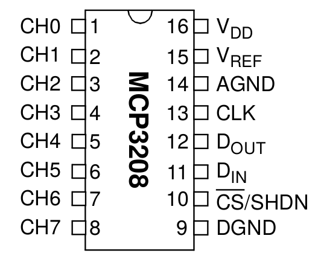
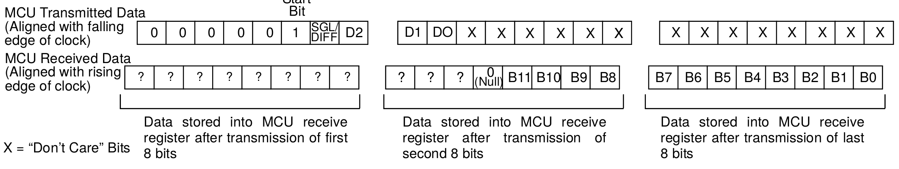
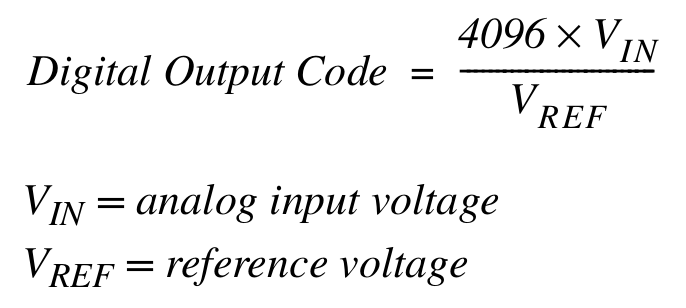

# MCP3208 Analog-Digital-Wandler

## Beschreibung

Der MCP3208 ist ein Analog-Digital-Wandler mit einer SPI-Schnittstelle. Er verfügt über 8 Kanäle mit einer Auflösung von 12 Bit.

## Beschaltung

- VDD: Spannungsversorgung (+) (3,3 V)
- Vref: Referenzspannung (legt den Messbereich fest, z.B. 3,3 V)
- AGND: Gemeinsame Masse der analogen Eingänge 
- CLK: Takt
- Dout: Data out (MISO)
- Din: Data in (MOSI)
- CS: Chip Select
- DGND: Spannungsversorgung (-) (Masse)
- CH0 .. CH7: Analoge Eingänge

Der MCP3208 kann mit einer Versorgungsspannung von 2,7 - 5,5 V betrieben werden. Zusätzlich muss eine Referenzspannung angelegt werden, die den Messbereich bestimmt. Eine kleine Referenzspannung ermöglicht eine genauere Messung und ist für kleine analoge Eingangssignale sinnvoll.

Weiterhin müssen die Busleitungen (CLK, Dout, Din, CS) am SPI-Bus des Masters (z.B. Raspberry Pi) angeschlossen werden.

## Datentransfer

Um die Spannung an einem Kanal zu messen, müssen insgesamt drei Byte vom Master zum Slave gesendet werden. Das erste Byte besteht aus fünf Nullen, einer Eins als Startbit, einer 1 für den single-ended Modus. Beim "single-ended" Modus wird die Spannung eines analogen Eingangs bezogen auf die gemeinsame Masse (AGND) gemssen. Mit dem "differential" Modus kann die Spannung zwischen zwei Eingangspins gemessen werden.

Die Bits D2 (letztes Bit im ersten Byte), D1 und D0 (die ersten Bits im zweiten Byte) geben an, an welchem Kanal gemessen werden soll. 

Die restlichen 14 Bits sind beliebig. Sie werden nur gesendet, damit der MCP3208 auch drei Byte zurück sendet.

Von den drei Byte, die der A/D-Wandler an den Master sendet stehen in den letzten 12 Bit die Informationen zur Spannung. Die folgende Formel gibt an, wie die Spannung codiert ist.

Um die zu Spannung am analogen Eingang zu berechnen, muss die Formel nach Vin umgestellt werden und die Referenzspannung eingesetzt werden.

## Quelltext

- [Beispielklasse](sample/MCP3208.py)

Die Beispielklasse für den MCP3208 kann mit dem Raspberry Pi verwendet werden. Der A/D-Wandler muss mit der Busnummer (SPI0 oder SPI1), Divicenummer (CE0 oder CE1) und der Referenzspannung initialisiert werden.

Mit der Methode read(channel) wird der angegebene Kanal gelesen und die Spannung in Volt zurückgegeben.

## Datenblatt

- [Datenblatt](doc/mcp3208_datasheet.pdf)

