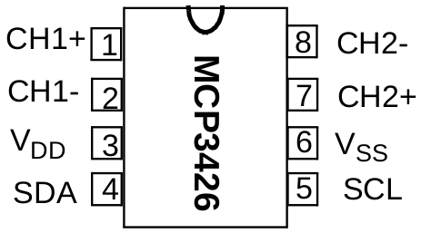
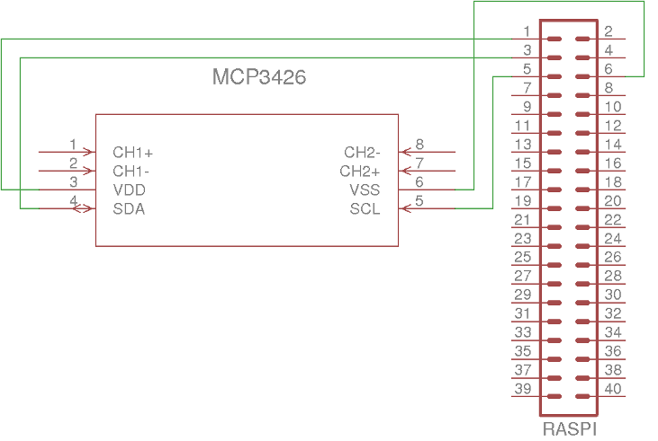

# MCP3426 Analog-Digital-Wandler

## Beschreibung

Der MCP3426 ist ein Analog-Digital-Wandler, mit einer I²C-Schnittstelle. Analoge Spannungen (Signale) können an zwei unabhängigen Kanälen gemessen werden. Die Auflösung beträgt je nach Konfiguration 12 Bit, 14 Bit oder 16 Bit.

## Beschaltung

- VDD: Spannungsversorgung (+) (3,3 V)
- VSS: Spannungsversorgung (-) (Masse)
- SDA: Serial Data (I²C)
- SCL: Serial Clock (I²C)
- CH1+, CH1-: Kanal 1
- CH2+, CH2-: Kanal 2

Auf Pulldown-Widerstände an den Busleitungen kann (und sollte) verzichtet werden, da diese bereits am Raspberry Pi vorhanden sind.

Die Eingangssignale werden an die positiven und negativen Eingangspins CH1 bzw. CH2
angelegt. Die gemessene Spannung ist also die Potentialdifferenz
zwischen CH+ und CH-.

Eine Referenzspannung kann nicht extern angelegt werden. Der MCP3426 verwendet eine interne Referenzspannung von `2,048 V`.

## Weitere Eigenschaften

### Slave-Adresse
Der AD-Wandler hat eine unveränderliche Adresse: `0x68`

### Messbereich
Es können Spannungen zwischen `-2,048 V` und `+2,048 V` gemessen werden. Je nach Konfiguration kann das Eingangssingal verstärkt werden. Dadurch verkleinert sich der Messbereich. Die Genauigkeit wird damit erhöht.

### Abtastrate
Die Abtastrate hängt von der konfigurierten Auflösung ab.
* 15 SPS (im 16-Bit-Modus)
* 60 SPS (im 14-Bit-Modus)
* 240 SPS (im 12-Bit-Modus)
SPS = samples per second

## Konfiguration

Mit der Standardkonfiguration wird Kanal 1 (CH1) im 12-Bit-Modus ohne Verstärkung verwendet. 

Durch Lesen des Registers `0x00` (2 Byte) kann die Spannung gemessen werden. Der Wert des Registers entspricht bei dieser Konfiguration der Eingangsspannung in Millivolt. Negative Werte sind im Zweierkomplement gespeichert. Weiterhin muss beachtet werden, dass beim Lesen des Registers die beiden Byte vertauscht sind.

Eine Beispielanwendung befindet sich im Ordner [sample](sample).

## Datenblatt

- [Datenblatt](doc/mcp3426_datasheet.pdf)
