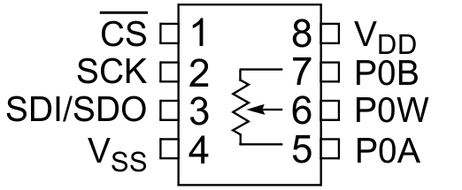

# MCP4151 Digitalpoteniometer

## Beschreibung

Der MCP4151 ist ein Digitalpotentiometer, das sich über die SPI-Schnittstelle 
steuern lässt. Das Bauteil gibt es mit den Widerstandswerten 5 kΩ, 10 kΩ, 50 
kΩ und 100 kΩ. Bei normalen Potentiometern wird der Schleiferkontakt 
mechanisch verändert. Beim Digitalpotentiometer wird die Position des 
Schleifers digital in einem Register gespeichert.

## Beschaltung

- VDD: Spannungsversorgung (+) (3,3 V)
- VSS: Spannungsversorgung (-) (Masse)
- SDI/SDO: Serial Data In / Serial Data Out (SPI)
- SCK: Serial Clock (SPI)
- CS: Chip Select (SPI)
- P0A/P0B: Potentiometerkontakte (gesamter Widerstand)
- POW: Potentiometerkontakt (Schleiferkontakt)

Normalerweise wird eine Datenleitung des SPI-Bus entweder als MOSI- oder als 
MISO-Leitung verwendet. Beim MCP4151 lassen sich die Registerwerte über eine 
Datenleitung sowohl lesen als auch schreiben. Für die Meisten Anwendungen 
genügt es aber in die Register zu schreiben, so dass der SDI/SDO-Pin als MOSI 
verwendet wird.

## Steuerung des Schleifers

Um den Schleifer zu steuern gibt es drei verschiedene Möglichkeiten:
- Schleifer ein Stück "weierscheiben" (inkrementieren): `0b00000100`
- Schleifer ein Stück "zurückschieben" (dekrementieren): `0b00001000`
- Schleifer auf eine beliebige Position setzen: `0b0000000* 0b********`

Für die Inkrementierung und Dekrementierung muss jeweils ein Kommandobyte 
übertragen werden. Um die Schleiferposition direkt einzustellen, folgt nach 
dem Kommandobyte die Schleiferposition. Da der Schleifer auf einen Wert 
zwischen 0 und 256 eingestellt werden kann (257 mögliche Positionen), wird 
auch das letzte Bit des Kommandobytes verwendet.

## Quelltext

Ein Beispielprogramm befindet sich in der Datei [mcp4151.py](mcp4151.py). 
Es stellt eine Klasse `MCP4151` bereit, die es ermöglicht, die 
Schleiferposition direkt oder durch Inkrementierung/Dekrementierung zu 
verändern.

## Datenblatt

- [Datenblatt](doc/mcp4151_datasheet.pdf)
