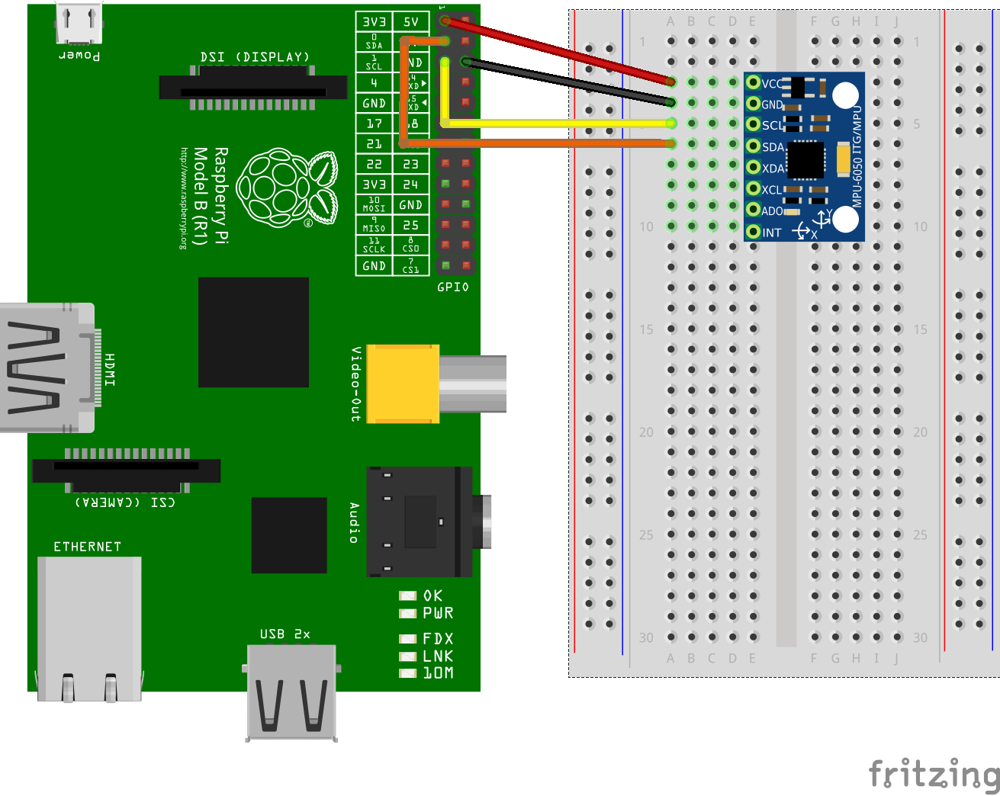

MPU6050 bzw. GY-521
===================

Der MPU 6050 ist ein Beschleunigungssensor und Gyrometer, der sich
über I²C auslesen lässt. Er wird häufig auf einem breakout-board mit
der Bezeichnung GY-521 geliefert.

Details werden in dem [Datenblatt des MPU6050](doc/mpu6050.pdf)
beschrieben. Eine Beschreibung der Register ist in einem separaten
Dokument [MPU6050 Register Map](doc/MPU-6000-6050-Register-Map.pdf)
verfügbar.

Schaltung
---------

Der IC kann über I²C direkt am Pi betrieben werden. Dort meldet er
sich unter der Adresse 0x68.

Links
-----

- [Anleitung für den Arduino](http://playground.arduino.cc/Main/MPU-6050)
