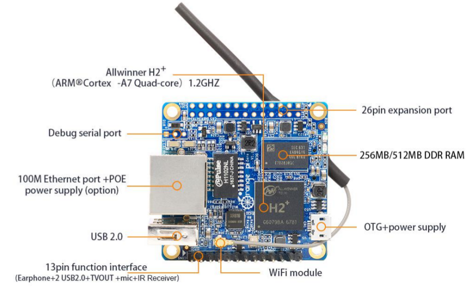

# Orange Pi Zero

## Beschreibung

Der Orange Pi Zero ist die kleine, ebenfalls günstige (ca. 8 €) und an den Pi
Zero angelehnte Version des [Orange Pi](http://www.orangepi.org/).

## Installation

In dem [Handbuch](doc/OrangePi_Zero_H2_User_Manual_v0.9.1.pdf)
wird die Inbetriebnahme ausführlich beschrieben.

