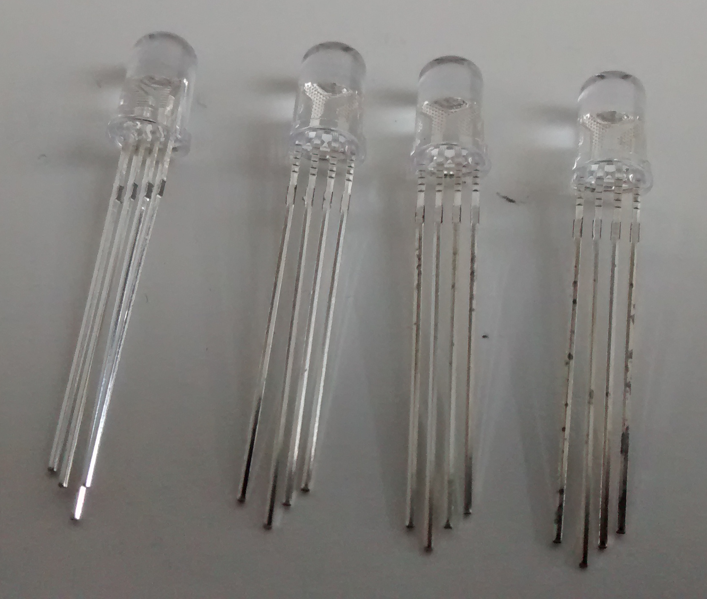
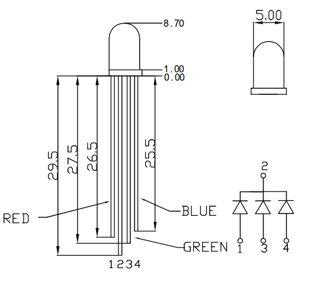
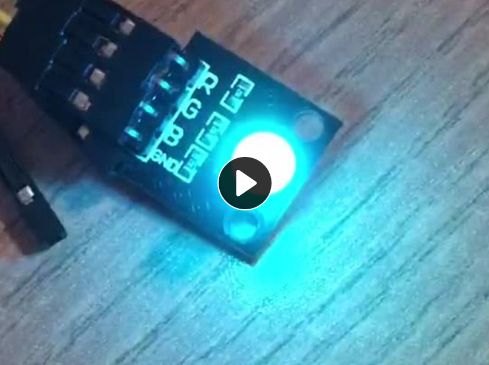

# RGB LED

RGB-LED können viele verschiedene Farben darstellen. Sie haben 
vier Pins: einen für die Masse und jeweils einen für Rot, Grün
und Blau. 

## Pinout

Eine 
[Beispielbeschaltung](http://wiring.org.co/learning/basics/rgbled.html) 
zeigt eine mögliche Verwendung.

## Quelltext

Mit der 
[gpiozero-Bibliothek](https://gpiozero.readthedocs.io/en/stable/api_output.html?#gpiozero.RGBLED) 
lassen sie sich sehr einfach ansteuern. Ein kommentiertes Beispiel befindet 
sich in der Datei [rgb_led.py](rgb_led.py).

## Demovideo

