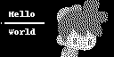

# OLED Display Treiber SH1106 

Es gibt auch OLED-Displays, die mit dem Treiber SH1106
arbeiten. Der Treiber lässt sich entweder über eine parallele
Schnittstelle, SPI oder I²C steuern.

Der Speicheraufbau und die Ansteuerung ist nahezu identisch, wie beim [SSD1306](../ssd1306). Ein wesentlicher Unterschied ist die Adressierung der Spalten und Zeilen. Die Adresse der "Page" (8 Zeilen des Displays) muss über ein Kommando festgelegt werden. Daher ist der SH1106 nicht 100%ig kompatibel mit der Adafruit-Bibliothek des SSD1306.


## Datenblatt

- [Datenblatt OLED-Display](doc/1_3_inch_OLED_Datenblatt_4bcd023d-b1d6-4297-a022-71c523c952fd.pdf) (von az-delivery.de)
- [Datenblatt SH1106](doc/sh1106_datasheet.pdf)

## Schaltung

Siehe [SSD1306](../ssd1306).

## Adressierung

Siehe [SSD1306](../ssd1306).

## Kommunikation

Siehe [SSD1306](../ssd1306).


## Quelltext

Der Quelltext der Datei [SH1106.py](SH1106.py) zeigt eine Klasse `SH1106_128_64` in der die Initialisierung und Konfiguration des Displays realisiert wird. 

Das Bild wird im Attribut _buffer gespeichert. Es handelt sich um eine Liste mit 128·8 (Breite·Pages) Bytes.

Mit der Methode display() wird der Inhalt des Buffers auf dem OLED-Display angezeigt.

Der Vorteil dieser Klasse ist, dass man nur die (standard) smbus-Bibliothek benötigt und 
keine weiteren Bibliotheken auf dem Raspberry Pi nachinstalliert werden müssen.

In der Datei [oled.py](oled.py) ist ein kurzes Beispielprogramm für die Verwendung der Bibliothek.

## Die Klasse `OledDisplay`

In der Datei [oleddisplay.py](oleddisplay.py) befindet sich eine Klasse `OledDisplay`,
welche die Verwendung des Display etwas vereinfacht. Hierfür wird zusätzlich das
Pythonpaket »pillow« benötigt, welches mit pip installiert werden kann.

Danach kann die Klasse wie folgt verwendet werden, um das folgende Bild zu erzeugen.



```python
import smbus
from oleddisplay import OledDisplay

disp = OledDisplay(i2c=smbus.SMBus(1))

# Initialize library.
disp.begin()

# Clear display.
disp.clear()
disp.display()

# Write two lines of text.
disp.draw_text('Hello', 10, 10)
disp.draw_text('World', 10, 30)

# draw a line
disp.draw_line(5, 25, 100, 25, 2)

# draw some pixels
disp.px(1, 25, True)
disp.px(1, 26, True)

# Draw image next to display
disp.draw_bitmap(50, -10, 'images/run1.png')

# Display image.
disp.display()
disp.save_to_file('oled_test.png')
```

## TODO
- Erweiterung der Klasse um Methoden px(x, y, value, buffered=True/False)
