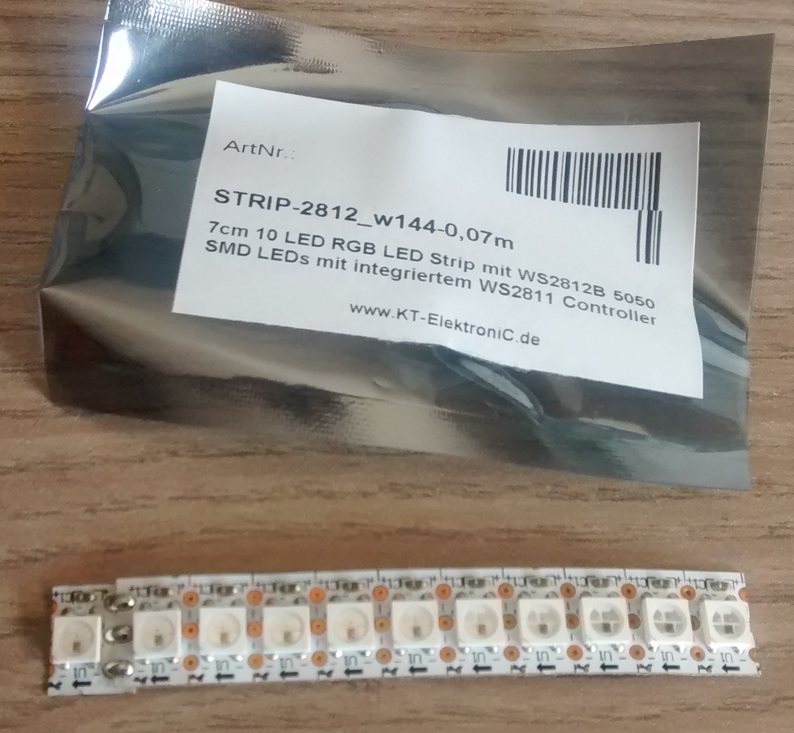

WS281x
======

Der WS2811 oder WS2812 ist ein Controller, mit dem RGB-LED auf einem 
Leuchtstreifen gezielt angesteuert werden können. Er ist ausführlich im
[Datenblatt](doc/WS2811.pdf) beschrieben.

Pegelwandler SN74AHCT125
------------------------

Da der Streifen mit 5V betrieben werden muss, wird ein Pegelwandler benötigt,
der die am Pi anliegenden 3,3V auf 5V herauf regelt.

          ┌────◡────┐
     1~OE ┤1      14├ Vcc
     1A   ┤2      13├ 4~OE
     1Y   ┤3      12├ 4A
     2~OE ┤4      11├ 4Y
     2A   ┤5      10├ 3~OE
     2Y   ┤6       9├ 3A
     GND  ┤7       8├ 3Y
          └─────────┘

Es sind vier Pegelwandler vorhanden, die einzeln mit `OE` (*output enable*) 
aktiviert werden können. Für den Wandler 1 werden dann z.B. die an `1A` 
anliegenden 3,3 V auf dem Ausgang an `1Y` auf 5 V heraufgeregelt, wenn die 
Versorgungsspannung an `VCC` 5 V beträgt.

Er wird in dem [Datenblatt](doc/sn74ahct125.pdf) beschrieben.

Schaltung
---------

Eine mögliche Beschaltung, die den Pegelwandler benutzt:

Auf diese Weise können nicht viele LEDs angesteuert werden, da die 
Stromversorgung des Pi nicht ausreichend ist. Ein externes Netzteil wird ab ca.
8 LED benötigt.

Bibliothek
----------

Für die Ansteuerung kann die Bibliothek 
[rpi_ws281x](https://github.com/jgarff/rpi_ws281x) verwendet werden.

    $ git clone https://github.com/jgarff/rpi_ws281x.git

Anschließend müssen die Module kompiliert und gemäß der Beschreibung in der 
Datei `README` installiert werden. Das Testprogramm kann mit `sudo ./test` 
ausgeführt werden und sollte die LEDs zu leuchten bringen.  

 

Ein [Video](https://peertube.fidonet.io/videos/embed/942d1d5f-0c3f-40c0-b2b9-cde6874fa496) 
zeigt ein Demo.

Verschiedene mögliche Probleme bzgl. HDMI und Audio des Pi werden auf der 
Projektseite von *rpi_ws281x* oder in 
[#103](https://github.com/jgarff/rpi_ws281x/issues/103) beschrieben. So muss 
das Soundmodul `snd_bcm2835` ggf. deaktiviert werden, da es mit dem PWM-Pin 
konkurriert. Die erfolgt duch

    $ echo "blacklist snd_bcm2835" >> /etc/modprobe.d/raspi-blacklist.conf"
    
Neben den Streifen gibt es auch Lichterketten, die den LED mehr Spielraum geben.

Ein [Video](https://peertube.fidonet.io/videos/embed/90ab8183-ee16-4d48-a40d-2dd470141f61) 
zeigt diese Lichterkette.

Über die Klasse *Adafruit_NeoPixel* kann die Licherkette mit Python angesteuert 
werden.

    ┌─────────────────────────────────────────────────────┐
    │ Adafruit_NeoPixel                                   │
    ├─────────────────────────────────────────────────────┤
    │                                                     │
    ├─────────────────────────────────────────────────────┤
    │ Adafruit_NeoPixel(num, pin, freq_hz, dma, invert,   │
    │                   brightness, channel, strip_type)  │
    │ begin(): void                                       │
    │ show(): void                                        │
    │ setPixelColorRGB(n, red, green, blue, white): void  │
    │ setBrightness(brightness): void                     │
    │ getPixels(): LED_Data                               │
    │ numPixels(): int                                    │
    | getPixelColor(n): Color                             │
    └─────────────────────────────────────────────────────┘

Quelltext
---------

Mit dem Programm in [ws281x.py](ws281x.py) wird ein roter Pixel über alle LEDs 
einer Lichterkette geschickt, so dass jede LED einmal kurz leuchtet.

Weitere Informationen
---------------------

Neben diesem Einstieg, gibt es eine weitere Anleitung 
[Neopixels on RaspberryPi](doc/neopixels-on-raspberry-pi.pdf), die zusätzliche
Informationen bereithält.

Das Projekt [WLED](https://kno.wled.ge/) macht die LEDs über einen ESP8266/32
ansteuerbar.

